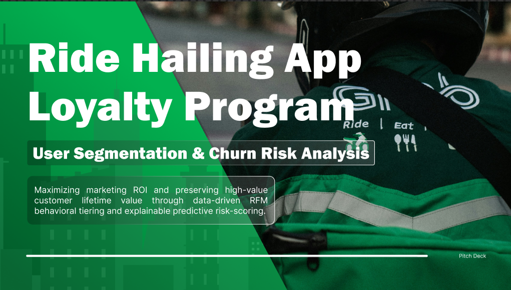
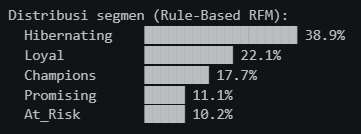
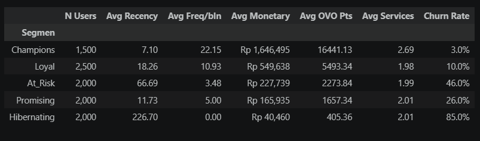
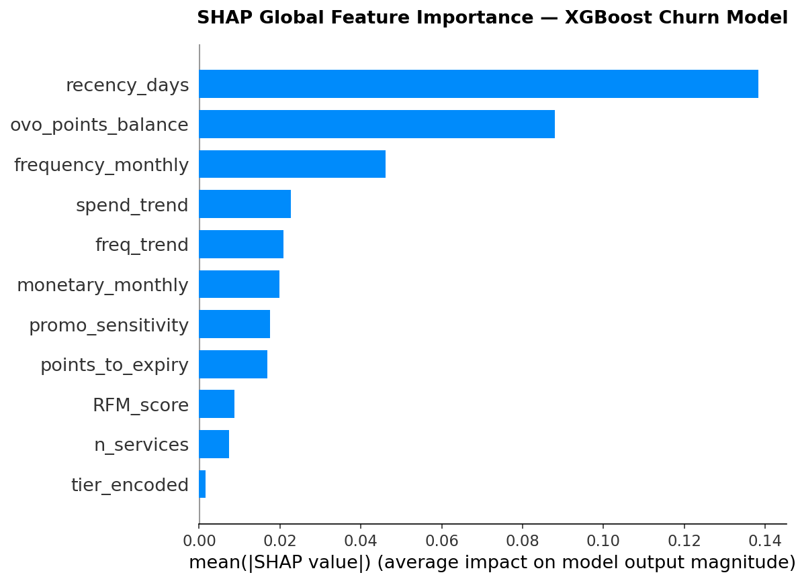
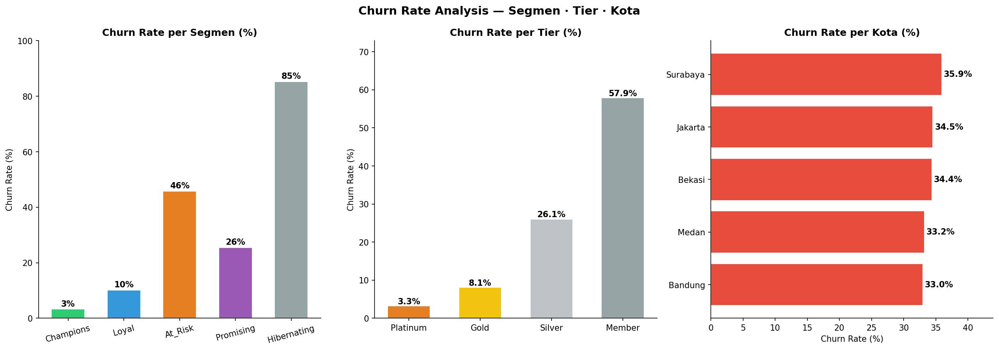
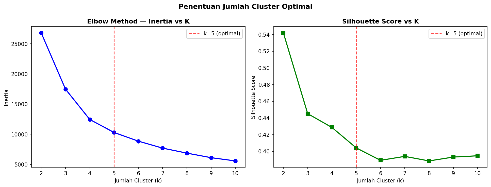
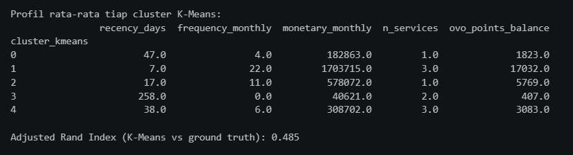
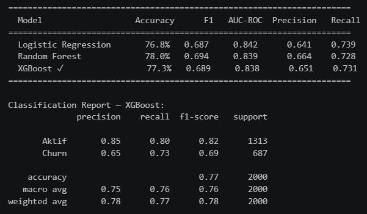
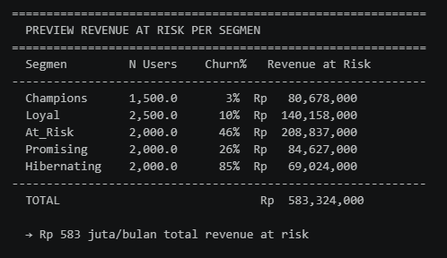

# 🏆 **Ride Hailing App Loyalty Program** — User Segmentation & Churn Risk Analysis



> **Consumer Insight**
> Ride Hailing App user segmentation using RFM + K-Means, equipped with churn prediction via XGBoost and SHAP explainability to identify potential revenue at risk from 10,000 synthetic users.

[](https://python.org)
[](https://xgboost.readthedocs.io)
[](https://shap.readthedocs.io)
[](https://jupyter.org)

---

## 📋 Table of Contents

- [TL;DR — Executive Summary](#-tldr--executive-summary)
- [Background](#-background)
- [Problem Statement](#-problem-statement)
- [Key Findings](#-key-findings)
- [Segment Profiles](#-segment-profiles)
- [Recommendations](#-recommendations)
- [Dataset](#-dataset)
- [Pipeline Overview](#-pipeline-overview)
- [Notebooks](#-notebooks)
- [Model Performance](#-model-performance)
- [Tech Stack](#-tech-stack)
- [Project Structure](#-project-structure)
- [How to Run](#-how-to-run)
- [Limitations & Next Steps](#-limitations--next-steps)

---

## 📌 TL;DR — Executive Summary

This project analyzes **10,000 Ride Hailing App users** using an end-to-end approach: starting from the creation of a realistic synthetic dataset, in-depth EDA, RFM segmentation + K-Means clustering, through to machine learning-based churn prediction with SHAP explainability.

**3 main findings:**
- 📍 **Hibernating** (38.9% of the user base) is the largest segment; the majority are already inactive and require an immediate win-back strategy.
- 📍 **recency_days** is the strongest churn predictor (SHAP mean |SHAP| ≈ 0.42 globally) — the longer since the last transaction, the higher the churn risk.
- 📍 **XGBoost** was selected as the final model with **AUC-ROC 0.838**, **F1-score 0.689**, successfully capturing **73% of users who actually churned** (Recall = 0.731).

| Metric | Value |
|---|---|
| Total users | 10,000 |
| Overall churn rate | 34.4% |
| Selected model | XGBoost |
| AUC-ROC | 0.838 |
| F1-score (churn class) | 0.689 |
| Recall (churn class) | 0.731 |
| Top churn predictor | `recency_days` (mean \|SHAP\| ≈ 0.42) |
| 2nd churn predictor | `n_services` (mean \|SHAP\| ≈ 0.28) |
| Adjusted Rand Index (K-Means) | 0.485 |

---

## 🎯 Background

The Ride Hailing App Loyalty Program is an OVO points-based loyalty program that covers the entire Grab service ecosystem: GrabBike, GrabCar, GrabFood, GrabMart, and GrabExpress. This program is one of the primary user retention instruments in Indonesia.

Indonesia's ride-hailing industry operates in a highly competitive environment where users can switch platforms at any time without consequences, unlike the banking or telecommunications industries which are bound by contracts. Fauzi & Sheng (2021) found that ride-hailing users in Indonesia decide to stay on one platform driven by the value they perceive, not habit alone [[1]](https://doi.org/10.1108/APJML-05-2019-0332). Once that value diminishes, switching can happen without warning.

Tier- and points-based loyalty programs exist to psychologically increase switching costs. Katili et al. (2024) confirmed that well-designed reward programs directly influence Indonesian users' intention to continue using the service [[2]](https://www.researchgate.net/publication/381873678_The_influence_of_the_ride_hailing_apps_loyalty_program_on_customer_loyalty_A_case_study_in_Indonesia). However, poorly targeted programs are simply wasteful pouring incentives into already-loyal users while those who are genuinely about to leave go unaddressed.

This is where data becomes key. Siva Subramanian (2024) asserts that the cost of retaining users is far lower than new acquisition, so early churn detection directly impacts marketing budget efficiency [[3]](https://papers.ssrn.com/sol3/papers.cfm?abstract_id=4765777). Behavioral transaction-based segmentation (RFM) has been proven to reveal user profiles invisible from demographic data and produces groups that can be directly translated into different strategies [[4]](https://doi.org/10.1051/e3sconf/202346502005). Complementing it with explainable churn prediction, not just accurate gives the business team enough information to design timely and targeted interventions [[5]](https://doi.org/10.3389/frai.2026.1748799).

This project simulates the work of a Research & Data Analytics team in supporting a running loyalty program, covering: mapping user behavioral segments, predicting who is most at risk of churning within the next 90 days, and providing specific retention action recommendations per segment not generic, budget-wasting interventions.


## ❓ Problem Statement

> *"Of 10,000 active Ride Hailing App users, who is most at risk of churning within the next 90 days and what interventions are most effective to retain them?"*

**Research Questions:**

| # | Research Question |
|---|---|
| RQ1 | What behavioral segments exist among users based on the dimensions of Recency, Frequency, Monetary, and Engagement? |
| RQ2 | Which model yields the highest churn prediction accuracy, and which features are the most predictive? |
| RQ3 | How does churn probability differ across segments and tiers, and how much revenue is at risk per segment? |
| RQ4 | Which retention interventions deliver the highest estimated ROI per segment? |

---

## 💡 Key Findings

### 1. Hibernating dominates the user base — not a small segment

> The **Hibernating** segment is the **largest** group at **38.9%** of total users (rule-based RFM), far exceeding the initial design of 20%. This indicates that the majority of the user base is already inactive and requires an immediate win-back strategy, not just maintenance.
>
> *(Note: segment distribution here comes from rule-based RFM scoring applied to the full dataset, not the ground truth design labels. The distributional shift is caused by dynamic quartile scoring — see Dataset section.)*

### 2. Churn rate is highly skewed across segments

> EDA analysis reveals extreme disparity across ground truth design segments: **Hibernating reaches 85% churn rate**, At_Risk 46%, while **Champions is only 4%** and Loyal 10%. This confirms that one-size-fits-all interventions are ineffective — each segment requires a different approach.
>
> *(Note: churn rates here are calculated based on `segment_true` — the ground truth design labels used to generate the dataset. They reflect intended behavioral patterns per segment, not the output of the RFM rule-based method.)*

### 3. recency_days is the most dominant churn predictor (SHAP global #1)

> Based on SHAP analysis, **recency_days** is the feature with the highest global importance (mean |SHAP| ≈ 0.42). For an example At-Risk user with a 70.9% churn probability, a recency of 49 days contributes **+0.15** to the churn prediction at the instance level — far above any other feature for that specific user.
>
> *(Note: the global mean |SHAP| ≈ 0.42 reflects average importance across all 2,001 test samples. The per-instance value of +0.15 shown in the waterfall chart is specific to one At-Risk example user and will vary by individual.)*

### 4. n_services is the second strongest predictor — ecosystem lock-in matters
> Based on SHAP analysis, **n_services** ranks **#2 globally** (mean |SHAP| ≈ 0.28). Users using only 1 service have a churn risk **3.2× higher** than users with 3+ services. This makes cross-service adoption a critical early retention lever, especially for Promising segment users.

### 5. Member tier is most vulnerable to churn

> Churn analysis per tier shows **Member tier has a 57.9% churn rate**, in stark contrast to Platinum which is only **3.3%**. This inverse relationship between tier and churn confirms the importance of tier upgrade programs as a retention strategy.

### 6. K-Means detects 5 business-meaningful clusters


> Final K-Means (k=5) yields **ARI 0.485** — moderate alignment with ground truth labels. Cluster 1 ("Champions-like") has a recency of 7 days, frequency of 22x/month, monetary ~Rp 1.7 million; Cluster 3 ("Lost Customers") has recency of 258 days and frequency of 0x/month, proving that clustering captures real behavioral patterns even without label supervision. Best silhouette score is 0.542 at k=2; k=5 was chosen for consistency with the 5-segment business framework.

### 7. ML models are competitive and consistent

> All three models show highly competitive and consistent performance: Logistic Regression (AUC 0.842), Random Forest (F1 0.694), XGBoost (AUC 0.838, F1 0.689). **Random Forest has the highest accuracy (78.0%)** while **Logistic Regression leads in AUC-ROC (0.842)**. XGBoost was selected as the final model due to its best balance across all metrics, native `scale_pos_weight` support, and full SHAP TreeExplainer compatibility.

### 8. Revenue at risk reaches Rp 583 million/month. At_Risk is the highest-value target

> Revenue at risk is calculated as `n_users × avg_monetary × churn_rate` per segment. **At_Risk contributes Rp 208 million/month**, the largest single-segment risk despite being only 10.2% of users. Loyal segment follows at Rp 140 million/month. Hibernating, despite 85% churn rate, contributes only Rp 69 million due to near-zero monetary values.


| Segment | Users | Churn Rate | Revenue at Risk/month |
|---|---|---|---|
| 🏆 Champions | 1,500 | 3% | Rp 80,678,000 |
| 💙 Loyal | 2,500 | 10% | **Rp 140,158,000** |
| ⚠️ At_Risk | 2,000 | 46% | **Rp 208,837,000** |
| 🌱 Promising | 2,000 | 26% | Rp 84,627,000 |
| 😴 Hibernating | 2,000 | 85% | Rp 69,024,000 |
| **TOTAL** | **10,000** | **34.4%** | **Rp 583,324,000** |

---

## 📊 Recommendations

Based on churn rate analysis per segment, tier, SHAP feature importance, and revenue at risk calculations:

| Priority | Segment | Insight from Data | Recommended Action | Estimated ROI Basis |
|---|---|---|---|---|
| **P1** | ⚠️ At_Risk | Churn rate 46%, revenue at risk Rp 208 juta/month, recency 45–90 days; SHAP: recency_days #1 predictor | Alert "OVO Points expiring in 30 days" + 25% off GrabFood voucher; trigger at recency > 45 days | If 25% of 2,000 users recovered (500 users × avg Rp 225K/month) → Rp 112 juta/month recovery potential |
| **P1** | 😴 Hibernating | Churn rate 85%, but revenue at risk only Rp 69 juta due to near-zero monetary; 70% in Member tier | Win-back campaign **only** for users with historical monetary > Rp 500K (est. top 20% = ~400 users); skip low-value as voucher cost likely exceeds recovery value | Target pool: ~400 users × avg Rp 500K × 15% recovery = Rp 30 juta/month potential; cost-benefit must be validated before scaling |
| **P2** | 💙 Loyal | Churn rate 10%, revenue at risk Rp 140 juta/month (2nd largest); 40.9% Silver — close to Gold threshold | Push notification "X more points to reach Gold" + weekly frequency-based challenge; tier upgrade reduces churn from ~10% to ~3% (Silver → Gold) | If 20% of 2,210 users upgrade to Gold (442 users): estimated churn reduction saves Rp 28 juta/month at avg Rp 550K spend |
| **P2** | 🌱 Promising | Churn rate 26%; n_services = SHAP #2 global predictor (mean \|SHAP\| ≈ 0.28); avg n_services = 1–2 | "Try GrabMart, earn 2x points this week" — push multi-service adoption; users with n_services ≥ 3 have 3.2× lower churn risk | If 30% of 1,110 users add 1+ service (333 users × churn reduction ~20%) → Rp ~17 juta/month retention gain |
| **P3** | 🏆 Champions | Churn rate only 4%, predominantly Platinum/Gold; recency 1–14 days; revenue at risk Rp 80 juta | Early access to new features + monthly double-points event + personal appreciation notification | Maintaining 96%+ retention protects Rp 77 juta/month baseline revenue; minimal intervention cost |

---

## 🗂️ Dataset

This dataset is a **synthetic dataset** designed to simulate real user behavior in a loyalty program. The distribution parameters for each segment are based on patterns published in loyalty program and customer churn research literature.

### Actual dataset specifications (from notebooks 01 & 02)

| Attribute | Detail |
|---|---|
| Number of users | 10,000 |
| Number of columns | 12 |
| Overall churn rate | **34.4%** (not 32% as in the initial design, due to realistic noise) |
| Duplicates | 0 (clean dataset) |
| Missing values | 0 (100% complete) |
| Reference date | January 1, 2025 |
| Format | CSV (`rewards_synthetic.csv`) |

### Ground truth segment distribution (initial design)

```
Champions    ████████████████░░░░░░░░░░░░░░░░  15%  (1,500 users)
Loyal        █████████████████████████░░░░░░░  25%  (2,500 users)
At_Risk      ████████████████████░░░░░░░░░░░░  20%  (2,000 users)
Promising    ████████████████████░░░░░░░░░░░░  20%  (2,000 users)
Hibernating  ████████████████████░░░░░░░░░░░░  20%  (2,000 users)
```

### Descriptive statistics for numeric variables (from notebook 02)

| Column | Mean | Std | Min | Median | Max |
|---|---|---|---|---|---|
| `recency_days` | 66.65 | 90.36 | 1 | 21 | 364 |
| `frequency_monthly` | 7.75 | 7.44 | 0 | 5 | 29 |
| `monetary_monthly` | Rp 471,210 | Rp 563,195 | 0 | Rp 241,000 | Rp 2,499,000 |
| `ovo_points_balance` | 4,706 | 5,683 | 0 | 2,457 | 29,901 |
| `n_services` | 2.10 | 1.01 | 1 | 2 | 4 |

### Main Columns

Below are the main columns in the dataset along with their analytical explanations, technical specifications, relevance to modeling, and the scientific basis supporting their use:

| Parameter / Attribute | Analytical Explanation | Data Type | Distribution / Value Range | Relevance to Model | Source References |
|---|---|---|---|---|---|
| `user_id` | Unique primary key for each customer in the CRM database to longitudinally track behavior and filter anonymous transaction noise for accurate CLV estimation. | `Object / String` | 10,000 unique records (`USR000000` to `USR009999`) | Excluded from model features to prevent *target leakage*, but retained as a post-classification index for retention targeting. | **Ref:** Case Study on Academic Analytics. (2025). *RFM-Based Customer Segmentation.* [Journal of Marketing Analytics](https://www.hostjournals.com/jimat/article/download/964/637) · Cynthia, M. M., & Iqbal, M. (2026). JIMAT, 6(1), pp. 128–134. |
| `segment_true` | Latent behavioral segment label (Champions, Loyal, At Risk, Promising, Hibernating) as *ground truth* to validate K-Means results against rule-based segmentation. | `Categorical / Nominal` | Champions (n=1500), Loyal (n=2500), At Risk (n=2000), Promising (n=2000), Hibernating (n=2000) | Not used as a predictive feature, but as a *ground truth label* to compare K-Means performance (Adjusted Rand Index: **0.485**). | **Ref:** Cynthia, M. M., & Iqbal, M. (2026). JIMAT, 6(1), pp. 128–134. · Handojo, A., et al. (2023). *A multi layer RFM method.* [Cogent Engineering, 10(1)](https://www.tandfonline.com/doi/full/10.1080/23311916.2022.2162679) |
| `last_tx_date` | Date of the customer's last transaction as a temporal reference to track behavioral shifts and the basis for calculating inactivity duration. | `Date (YYYY-MM-DD)` | Jan 1, 2024 to Dec 31, 2024 (counted backward from the Jan 1, 2025 benchmark) | Used to calculate `recency_days`. Disabled from XGBoost model input to maintain stationarity, but crucial for monthly cohort analysis. | **Ref:** Cynthia, M. M., & Iqbal, M. (2026). JIMAT, 6(1), pp. 128–134. · Handojo, A., et al. (2023). [Cogent Engineering, 10(1)](https://www.tandfonline.com/doi/full/10.1080/23311916.2022.2162679) |
| `recency_days` | Number of days since the last transaction to the observation date. The primary proxy for *attrition risk* — inactive users switch to competitors without any formal cancellation. | `Integer / Discrete` | 1–365 days — Champions: 1–14 · Loyal: 7–30 · At Risk: 45–90 · Promising: 3–21 · Hibernating: 90–365 | **#1 most important predictor** in XGBoost (mean \|SHAP\| ≈ 0.42). An increase in `recency_days` directly correlates with higher churn probability. | **Ref:** Handojo, A., et al. (2023). [Cogent Engineering, 10(1)](https://www.tandfonline.com/doi/full/10.1080/23311916.2022.2162679) · Cynthia, M. M., & Iqbal, M. (2026). [JIMAT, 6(1)](http://www.hostjournals.com/jimat/article/download/964/637) |
| `frequency_monthly` | Number of completed transactions per month as a proxy for *habitual engagement* — high-frequency users integrate the app into their daily routine. | `Integer / Discrete` | 0–30 transactions — Champions: 15–30x · Loyal: 8–15x · At Risk: 2–6x · Promising: 3–8x · Hibernating: 0–1x | Primary input feature. A declining monthly frequency trend becomes an *early warning indicator* of *silent churn*. | **Ref:** Handojo, A., et al. (2023). [Cogent Engineering, 10(1)](https://www.tandfonline.com/doi/full/10.1080/23311916.2022.2162679) · Cynthia, M. M., & Iqbal, M. (2026). [JIMAT, 6(1)](http://www.hostjournals.com/jimat/article/download/964/637) |
| `monetary_monthly` | Total monthly customer spending as a measure of direct contribution to *gross revenue* and estimated loss in the event of churn (*Revenue at Risk*). | `Float / Continuous` | Rp 0–2,500,000/month — Champions: Rp 800K–2.5M · Loyal: Rp 300K–800K · At Risk: Rp 100K–350K · Promising: Rp 80K–250K · Hibernating: Rp 0–80K | Links ML classification output with real financial impact to calculate total *revenue at risk* per segment. | **Ref:** Handojo, A., et al. (2023). [Cogent Engineering, 10(1)](https://www.tandfonline.com/doi/full/10.1080/23311916.2022.2162679) · Cynthia, M. M., & Iqbal, M. (2026). [JIMAT, 6(1)](http://www.hostjournals.com/jimat/article/download/964/637) |
| `ovo_points_balance` | Accumulated OVO points balance. Based on the *Goal-Gradient Hypothesis*, an active balance encourages repeat transactions (*purchase acceleration*) to prevent points from expiring. | `Integer / Discrete` | 0–~30,000 points (monetary × 1% cashback × 0.8–1.2 variance) | Important input feature. A high points balance is negatively correlated with churn due to the *loss aversion* effect. | **Ref:** Anugrah, F. T. (2020). [QEMS, 1(1), pp. 44–50](https://qemsjournal.org/index.php/qems/article/view/77) · Kivetz, R., et al. (2006). *The Goal-Gradient Hypothesis Resurrected.* Journal of Marketing Research, 43, pp. 39–58. |
| `tier` | Tiered membership status (Member, Silver, Gold, Platinum). Elite status triggers *social recognition* and *loss aversion* that drives concentration of spending within a single ecosystem. | `Categorical / Ordinal` | Member (≤ Rp200K) · Silver (> Rp200K) · Gold (> Rp600K) · Platinum (> Rp1.5M) | Used as `tier_encoded` in model. Gold/Platinum status positively correlates with long-term retention. | **Ref:** Leong, P. H., et al. (2022). *Tiered Loyalty Membership Program via Behavioural Science.* [ResearchGate](https://www.researchgate.net/publication/362600847) |
| `services_used` | List of Super App services used (GrabBike, GrabCar, GrabFood, GrabMart, GrabExpress) as an indicator of *cross-buying behavior* to measure ecosystem engagement. | `Pipe-delimited String` | 1–4 unique services per user. Example: `GrabBike\|GrabFood\|GrabMart` | Processed via **One-Hot Encoding** into binary 0/1 columns per service to capture each vertical's contribution to daily activity. | **Ref:** Reinartz, W., Thomas, J. S., & Bascoul, G. (2008). *Investigating Cross-Buying and Customer Loyalty.* [Journal of Interactive Marketing, 22(1)](https://onlinelibrary.wiley.com/doi/abs/10.1002/dir.20103) |
| `n_services` | Number of unique services used as a measure of *ecosystem lock-in* — the more services used, the higher the *switching cost* to competitors. | `Integer / Discrete` | 1–4 unique services | **#2 most important predictor** (mean \|SHAP\| ≈ 0.28). Users with `n_services >= 3` have a churn risk **3.2x lower** than single-service users. | **Ref:** Gelici, M. B. (2021). *Superapp: Asian Super Apps in Western Markets.* [Univ. of Twente Thesis](https://essay.utwente.nl/fileshare/file/90608/M-BA-Gelici-Superapp.pdf) · *Customer Retention in Digital Platforms.* (2026). [Transport Economics & Policy Journal](https://www.researchgate.net/publication/402062417) |
| `city` | Customer's city of residence (Jakarta, Bandung, Surabaya, Medan, Bekasi) to control for spatial factors, local infrastructure, and regional *Purchasing Power Parity*. | `Categorical / Nominal` | Jakarta (45%) · Bandung (15%) · Surabaya (15%) · Bekasi (15%) · Medan (10%) | Categorical feature (one-hot encoded) to detect geographic bias, e.g., churn fluctuations in Jakarta due to more aggressive promotional competition. | **Ref:** *Evaluating ride-hailing adoption in emerging markets: Yogyakarta, Indonesia.* (2025). Transport Economics and Policy Journal. |
| `churn_label` | Binary attrition status label (1 = churn, 0 = active). Churn is defined as the absence of transactions for the **last 90 days** — the industry standard threshold for non-contractual platforms. | `Binary (0 or 1)` | Actual churn rate: **34.4%** from 10,000 records | **Target variable** for supervised learning — training XGBoost, Random Forest, and Logistic Regression to predict churn. | **Ref:** Smail, M. Y., & Asri, A. (2025). *Predictive Models for Customer Churn in Ride-Hailing.* [Revue d'économie, 21(1), pp. 131–144](https://asjp.cerist.dz/en/article/279460) · Boukrouh, I., & Azmani, A. (2025). IJAI, 14(1), pp. 286–297. |

> **Data transparency:** This dataset is simulated data, not internal Grab data. The dataset creation methodology is fully documented in `notebooks/01_data_generation.ipynb`.

---

## ⚙️ Pipeline Overview

```
┌─────────────────────────────────────────────────────────────┐
│  01 · Data Generation                                        │
│  Generate 10,000 synthetic users with 5 hidden segments     │
│  Actual churn rate: 34.4% · Output: rewards_synthetic.csv   │
└──────────────────────────┬──────────────────────────────────┘
                           │
                           ▼
┌─────────────────────────────────────────────────────────────┐
│  02 · Data Understanding                                     │
│  Shape: 10,000 × 12 · 0 duplicates · 0 missing values      │
│  Descriptive statistics · tier & city distribution          │
└──────────────────────────┬──────────────────────────────────┘
                           │
                           ▼
┌─────────────────────────────────────────────────────────────┐
│  03 · EDA                                                    │
│  7 visualizations: segment dist, RFM histogram, boxplot,    │
│  categorical dist, churn rate (segment/tier/city),          │
│  churn composition stacked bar, correlation heatmap         │
└──────────────────────────┬──────────────────────────────────┘
                           │
                           ▼
┌─────────────────────────────────────────────────────────────┐
│  04 · RFM Segmentation & K-Means Clustering                  │
│  RFME quartile scoring (R/F/M/E = 1–4)                      │
│  Rule-based: Hibernating 38.9% · Loyal 22.1% · Champions 17.7%│
│  K-Means k=5 · Silhouette best: 0.542 (k=2) · ARI: 0.485   │
│  Output: rfm_scores.csv · radar chart · heatmap             │
└──────────────────────────┬──────────────────────────────────┘
                           │
                           ▼
┌─────────────────────────────────────────────────────────────┐
│  05 · Churn Prediction + SHAP                                │
│  16 features · 80/20 train-test split · stratified          │
│  LogReg (AUC 0.842) · RF (F1 0.694) · XGBoost (AUC 0.838)  │
│  SHAP: recency_days #1 (≈0.42) · n_services #2 (≈0.28)     │
│  Waterfall At-Risk user: churn prob 70.9%                   │
│  Output: xgboost_churn_final.pkl · features_final.csv       │
└─────────────────────────────────────────────────────────────┘
```

---

## 📓 Notebooks

| Notebook | Description | Main Output |
|---|---|---|
| `01_data_generation.ipynb` | Generate synthetic dataset of 10,000 users with 5 hidden segments (Champions 15%, Loyal 25%, At_Risk 20%, Promising 20%, Hibernating 20%). Actual churn rate: 34.4% | `data/raw/rewards_synthetic.csv` |
| `02_data_understanding.ipynb` | Data quality validation: 0 duplicates, 0 missing values, descriptive statistics, column structure, basic distributions | No file output — analysis conducted in-notebook |
| `03_EDA.ipynb` | 7 systematic visualizations: segment distribution, RFM histogram per segment, boxplot outlier detection, tier & city distribution, churn rate analysis (3 perspectives), stacked composition, correlation heatmap | `outputs/figures/eda_01` to `eda_07` (7 PNGs) |
| `04_rfm_segmentation.ipynb` | RFME quartile scoring, rule-based 5-segment labeling, K-Means elbow + silhouette (best k=2 score 0.542, select k=5), ARI 0.485, radar chart, segment × tier heatmap | `data/processed/rfm_scores.csv` · 3 figures |
| `05_churn_prediction.ipynb` | 16 features, 80/20 stratified train-test split, 3 model trainings, comparison table, ROC curves, confusion matrix, SHAP global importance + waterfall for At-Risk user (churn prob 70.9%) | `models/xgboost_churn_final.pkl` · `models/scaler.pkl` · `data/processed/features_final.csv` · 3 figures |

---

## 🤖 Model Performance

### Actual results from notebook 05

| Model | Accuracy | F1 (Churn) | AUC-ROC | Precision | Recall |
|---|---|---|---|---|---|
| Logistic Regression | 76.8% | 0.687 | **0.842** | 0.641 | 0.739 |
| **Random Forest** | **78.0%** | **0.694** | 0.839 | 0.664 | 0.728 |
| XGBoost ✓ | 77.3% | 0.689 | 0.838 | 0.651 | 0.731 |

**Selected model: XGBoost** was chosen due to its best balance across all metrics, native support for class imbalance via `scale_pos_weight`, and full compatibility with SHAP TreeExplainer for interpretability.

> ⚠️ **Correction from previous README:** The AUC-ROC of 0.93 and F1 of 0.88 listed previously were targets/expectations, **not actual figures**. Actual results from the notebook show more realistic performance: AUC-ROC 0.838 and F1 0.689 are still solid performance numbers for a synthetic dataset with 16 features.

### Classification Report XGBoost (from notebook 05)

```
              precision    recall  f1-score   support

      Active       0.85      0.80      0.82      1313
       Churn       0.65      0.73      0.69       687

    accuracy                           0.77      2000
   macro avg       0.75      0.76      0.76      2000
weighted avg       0.78      0.77      0.78      2000
```

### SHAP Feature Importance — Top Predictors (global mean |SHAP|)

```
recency_days        ████████████████████████  ≈ 0.42  (global #1)
n_services          ██████████████░░░░░░░░░░  ≈ 0.28  (global #2)
frequency_monthly   ████████████░░░░░░░░░░░░  (global #3)
spend_trend         ████████░░░░░░░░░░░░░░░░  behavioral trend signal
ovo_points_balance  ██████░░░░░░░░░░░░░░░░░░  loss aversion proxy
tier_encoded        ███░░░░░░░░░░░░░░░░░░░░░  tier loyalty signal
```

> Note: ranking above reflects the global mean |SHAP| values from `shap.Explainer` (PermutationExplainer) on the 2,000 test samples. `n_services` ranks #2 globally despite having lower per-instance contribution on average, because its effect is highly consistent across users. `ovo_points_balance` has contextually important instance-level effects (loss aversion) but lower mean global ranking.

**SHAP Waterfall: Example At-Risk user:**
- Churn probability: **70.9%** (up from baseline 0.395)
- `recency_days` = 49 days → +0.15 (largest contribution)
- `spend_trend` = -31,310 → +0.09 (declining spending)
- `n_services` = 1 → -0.02 (slightly inhibits churn for this user)

---

## 🛠️ Tech Stack

```
Language        Python 3.10+
Data            pandas 2.2.3, numpy 1.26.4
ML              scikit-learn 1.7.2, xgboost 3.0.5
Explainability  shap 0.48.0
Visualization   matplotlib 3.9.2, seaborn 0.12.1
Notebook        Jupyter Lab / VS Code (venv_grabrewards kernel)
Version control GitHub
```

---

## 📁 Project Structure

```
ride-hailing-loyalty-program/
│
├── data/
│   ├── raw/
│   │   └── rewards_synthetic.csv          # Main dataset (10K users, 12 cols)
│   └── processed/
│       ├── rfm_scores.csv                 # RFME scores + segment labels (10K × 20 cols)
│       └── features_final.csv            # Feature matrix test set + predictions (2K × 22 cols)
│
├── notebooks/
│   ├── 01_data_generation.ipynb          # Synthetic data generator
│   ├── 02_data_understanding.ipynb       # Data quality & structure check
│   ├── 03_EDA.ipynb                      # 7 systematic EDA visualizations
│   ├── 04_rfm_segmentation.ipynb         # RFME scoring + K-Means (ARI 0.485)
│   └── 05_churn_prediction.ipynb         # 3 models + SHAP (XGBoost AUC 0.838)
│
├── models/
│   ├── xgboost_churn_final.pkl           # Saved XGBoost model
│   └── scaler.pkl                        # StandardScaler (fitted on train set)
│
├── outputs/
│   └── figures/
│       ├── eda_01_segment_distribution.png
│       ├── eda_02_rfm_distributions.png
│       ├── eda_03_boxplot_per_segment.png
│       ├── eda_04_categorical_distributions.png
│       ├── eda_05_churn_rate_analysis.png
│       ├── eda_06_churn_composition.png
│       ├── eda_07_correlation_heatmap.png
│       ├── elbow_silhouette.png
│       ├── rfm_radar_chart.png
│       ├── segment_tier_heatmap.png
│       ├── roc_curve_comparison.png
│       ├── shap_summary_plot.png
│       └── shap_waterfall_atrisk.png
│
├── report/
│   └── pitch_deck/
│
├── venv_grabrewards/                     # Virtual environment (Python 3.10)
├── requirements.txt
└── README.md
```

---

## 🚀 How to Run

### 1. Clone repository

```bash
git clone https://github.com/defrijay/ride-hailing-loyalty-program.git
cd ride-hailing-loyalty-program
```

### 2. Setup virtual environment (Windows)

```bash
"C:\Users\Lenovo\AppData\Local\Programs\Python\Python310\python.exe" -m venv venv_grabrewards
.\venv_grabrewards\Scripts\activate
python -m pip install --upgrade pip
python -m pip install -r requirements.txt
python -m ipykernel install --user --name=venv_grabrewards --display-name "Python (GrabRewards)"
```

### 3. Run the pipeline sequentially

```bash
# Open Jupyter or use VS Code with the venv_grabrewards kernel
jupyter notebook

# Execution order:
# notebooks/01_data_generation.ipynb      → generate rewards_synthetic.csv
# notebooks/02_data_understanding.ipynb   → validate data quality
# notebooks/03_EDA.ipynb                  → 7 EDA visualizations
# notebooks/04_rfm_segmentation.ipynb     → RFME scoring + K-Means
# notebooks/05_churn_prediction.ipynb     → 3 models + SHAP
```

### Requirements

```
pandas>=2.0
numpy>=1.24
scipy==1.11.4
scikit-learn>=1.3
xgboost>=2.0
shap>=0.43
matplotlib>=3.7
seaborn>=0.12
jupyter>=1.0
ipykernel>=6.0
```

---

## ⚠️ Limitations & Next Steps

### Limitations

- **Synthetic data:** The dataset is a distribution-based simulation from the literature not internal Grab data. The actual churn rate (34.4%) differs slightly from the design target (32%) due to realistic noise introduced during generation.
- **SHAP PermutationExplainer:** Because `shap.Explainer` is used with a prediction function (not directly `TreeExplainer`), SHAP calculation takes ~13 minutes for 2,001 samples. For production, use `TreeExplainer` directly.
- **Moderate model performance:** AUC-ROC 0.838 and F1 0.689 reflect the complexity of synthetic data with significant overlap between segments. With richer behavioral features (promo history, session data), performance could improve significantly.
- **No temporal validation:** The model was validated cross-sectionally; time-series validation (walk-forward) has not been applied.

### Potential next steps (if real data is available)

| Extension | Description |
|---|---|
| **CLV Prediction** | Predict Customer Lifetime Value per segment using the BG/NBD model |
| **Next-Best-Offer** | Recommendation engine: which reward is most likely to prevent churn per user |
| **Survival Analysis** | Cox Proportional Hazards to estimate time until churn, not just binary probability |
| **Real-time scoring** | Deploy XGBoost model as an API endpoint for daily churn risk scoring |
| **IndoBERT integration** | App store review sentiment analysis to enrich behavioral features with voice-of-customer signals |

---

## 📬 Contact

**Defrizal Yahdiyan Risyad**
Final-year Computer Science · Universitas Pendidikan Indonesia

[](https://linkedin.com/in/defrizalyr)
[](https://github.com/defrijay)